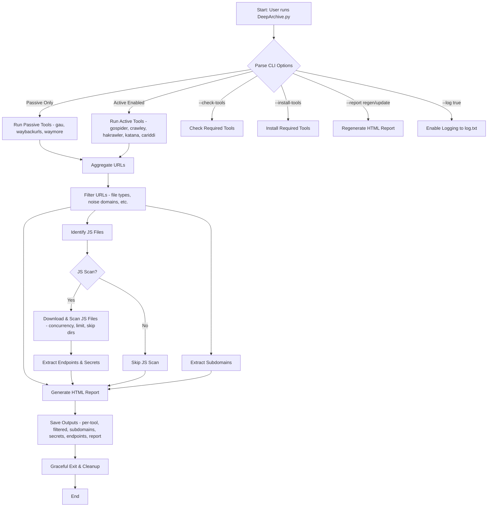
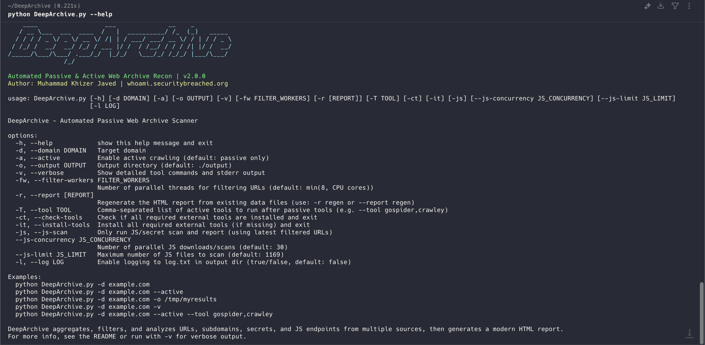

# DeepArchive

Automated Passive & Active Web Archive Reconnaissance & Reporting Tool

---

## 🚀 What is DeepArchive?

**DeepArchive** is a modular, async/await-friendly, and highly automated tool for web archive scanning and recon. It aggregates URLs from multiple passive and active sources, filters and analyzes them for interesting files, secrets, endpoints, and subdomains, and generates HTML report for your target.

---
## Workflow:

---

## ✨ Features

- **Passive & Active workflows**
- Integrates top recon tools
- Per-tool output, deduplication, and aggregation
- Smart filtering for interesting file types (JS, JSON, XML, PDF, etc.)
- Noise domain exclusion
- Subdomain extraction
- Secret and leak scanning (URLs & JS content)
- JS endpoint extraction
- Robust error handling and graceful exit
- Modern HTML report with search, filtering, and summary
- YAML config file for persistent, user-editable defaults (config/default.config.yaml)
---
## 🛠️ Tool References

DeepArchive integrates the following open-source tools:

- [gau (getallurls)](https://github.com/lc/gau)
- [waybackurls](https://github.com/tomnomnom/waybackurls)
- [waymore](https://github.com/xnl-h4ck3r/waymore)
- [gospider](https://github.com/jaeles-project/gospider)
- [crawley](https://github.com/s0rg/crawley)
- [cariddi](https://github.com/edoardottt/cariddi)
- [hakrawler](https://github.com/hakluke/hakrawler)
- [katana](https://github.com/projectdiscovery/katana)

See each repository for installation, usage, and advanced options
---



---

## 🖥️ Usage

```bash
python3 DeepArchive.py -d <target> [options]
```

### CLI Options

| Option | Description | Default |
|--------|-------------|---------|
| `-d, --domain` | Target domain | **Required** |
| `-a, --active` | Enable active crawling | Passive only |
| `-o, --output` | Output directory | `./output` |
| `-v, --verbose` | Show detailed tool commands and errors | Off |
| `-fw, --filter-workers N` | Number of parallel threads for filtering URLs | `min(8, CPU cores)` |
| `-T, --tool` | Comma-separated list of active tools to run after passive tools | All active tools |
| `-js, --js-scan` | Only run JS/secret scan and report (using latest filtered URLs) | Off |
| `--js-concurrency N` | Number of parallel JS downloads/scans | `30` |
| `--js-limit N` | Maximum number of JS files to scan | `1169` |
| `-ct, --check-tools` | Check if all required external tools are installed and exit | Off |
| `-it, --install-tools` | Install all required external tools (if missing) and exit | Off |
| `-r, --report [regen or update]` | Regenerate the HTML report from existing data files | Off |
| `-l, --log true/false` | Enable logging to log.txt in output dir | false |

---

## ⚙️ Default Configuration via YAML

DeepArchive supports a user-editable YAML config file for persistent defaults:

- **File:** `config/default.config.yaml`
- **Purpose:** Set your preferred defaults for all major options (active mode, filter workers, JS concurrency, logging, etc.)
- **How it works:**
  - On startup, DeepArchive loads this file and uses its values as defaults for all CLI options.
  - **Any CLI flag you provide will override the config value.**
  - If you don't edit the file, the built-in defaults are used.

**Note:** If you delete or rename the config file, DeepArchive will fall back to its built-in defaults.

---

## 📋 Example Commands

**Passive scan:**
```python
python3 DeepArchive.py -d example.com
```

**Active scan:**
```python
python3 DeepArchive.py -d example.com --active
```

**Custom output directory:**
```python
python3 DeepArchive.py -d example.com -o /tmp/myresults
```

**Verbose mode:**
```python
python3 DeepArchive.py -d example.com -v
```

**Custom filter worker count:**
```python
python3 DeepArchive.py -d example.com -fw 4
```

**Selective active tool run:**
```python
python3 DeepArchive.py -d example.com --active --tool gospider,crawley
```

**Check required tools:**
```python
python3 DeepArchive.py -ct
```

**Install all required tools (if missing):**
```python
python3 DeepArchive.py -it
```

**Regenerate HTML report from existing data:**
```python
python3 DeepArchive.py -d example.com -r regen
```

**JS/Secret scan only (default concurrency/limit):**
```python
python3 DeepArchive.py -d example.com --js-scan
```

**JS/Secret scan only (custom concurrency and limit):**
```python
python3 DeepArchive.py -d example.com --js-scan --js-concurrency 50 --js-limit 5000
```

If more than the limit are found, only the first N are scanned and a warning is shown. Increase `--js-limit` to scan more files.

---

## 📂 Output & Reporting

- All output is saved in `output/<target>/`
- **Per-tool output:** `<target>_gau.txt`, `<target>_cariddi.txt`, etc.
- **Aggregated URLs:** `<target>_all_raw_urls.txt`
- **Filtered URLs:** `<target>_filtered_urls.txt`
- **Subdomains:** `<target>_subdomains.txt`
- **Secrets/Leaks:** `<target>_secrets.txt`
- **JS Endpoints:** `<target>_js_endpoints.txt`
- **HTML Report:** `<target>_report.html`
- **No empty files** are created
- **Cache** is per-target and cleaned up after each run
- **Logs** If you enable logging with `--log true`, all scan details, warnings, errors, and tool output will be saved to `log.txt` in the output directory for each scan.
---

## 🔑 Secret & Leak Detection

DeepArchive uses an extensive and extensible set of regex patterns to detect secrets, API keys, tokens, credentials, and sensitive config in URLs, JS files, and multi-line strings (such as .env dumps). The secret detection engine now supports:

- **.env-style assignments** (e.g., `KEY=VALUE`)
- **Sensitive variable names** (e.g., `DB_PASS`, `SECRET_KEY`, `NODE_ENV`, etc.)
- **Assignments with sensitive keywords** (e.g., `my_secret_token = ...`)
- **Cloud provider keys** (AWS, GCP, Azure, DigitalOcean, Heroku, Dropbox, Atlassian, etc.)
- **CI/CD tokens** (CircleCI, Travis, Netlify, GitLab, SonarQube, Docker Hub, etc.)
- **OAuth, JWT, and SSO tokens**
- **Database URIs** (PostgreSQL, MySQL, MongoDB, Redis, etc.)
- **API keys and generic credentials** (Mailgun, Stripe, Shopify, Algolia, Mapbox, etc.)
- **SSH keys and certificates**
- **Slack webhooks and other service URLs**
- **High-entropy/generic secrets** (fallback patterns)

All patterns are in `config/secret_patterns.txt` and can be extended by the user. The scanning logic splits multi-line strings and scans each line, so secrets in config dumps or embedded blocks are detected.
Most of the secrts scaning right now are adobted from [https://github.com/streaak/keyhacks](https://github.com/streaak/keyhacks)

**To add new patterns:**
- Edit `config/secret_patterns.txt` (format: `regex # Label`)
- Patterns are applied to every line of JS, .env, and config content
- You can add your own for custom or internal secret types

---

## 📝 To-Do & 🔮 Future Improvements
- [ ] Add support for more tools (suggestions welcome)
- [ ] Add Dockerfile for easy setup
- [ ] Improve regex patterns for endpoint and secret detection

---

## 💡 Suggestions & Best Practices
- Always run with `--active` for deeper results (if allowed by scope)
- Review the HTML report for quick insights and drill down into raw files for details
- Use the per-tool outputs for custom post-processing
- Keep your config files (`config/`) up to date for best filtering and secret detection
- Run multiple scans in parallel—Cariddi cache is now isolated per target!
- Use `--js-limit` and `--js-concurrency` to control JS scan performance and resource usage

---

## 👨‍💻 Author

**Muhammad Khizer Javed**  
[whoami.securitybreached.org](https://whoami.securitybreached.org)

**And a bunch of LLMs 🤖👀**

---

## 📢 Contributions & Feedback

Pull requests, issues, and suggestions are welcome!

---
